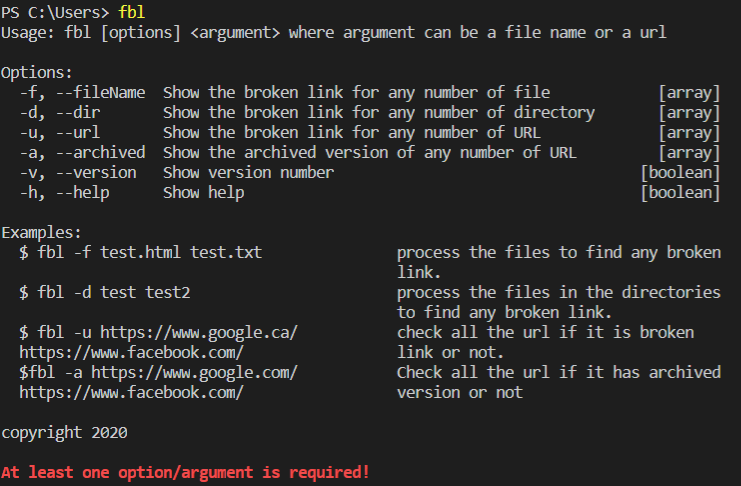

# fbl(find-broken-link)

This is a command line tool designed to report broken link and their status, such as good, bad, redirect, unknown and not exist. 

## Feature



* Identify different types of URL with status code in colour coded:
    - Good link - status code `200`
    - Redirect link - status code `301`, `307`, `308`
    - Bad link - status code `400`, `404`
    - Unknown link - status code except above ones
    - Not exist link - status code with timeout and DNS issues
* Find broken links for one or more file
* Find broken links for one or more file in one or more directory
* Find broken links directly from one or more URL
* FInd archvied version of link directly from one or more URL

## Installation

### Pre-requisite

To use this CLI, you will need node and npm installed. [Download and install Node](https://nodejs.org/en/download/) before proceeding with the installation of this CLI.

### Install `fbl` CLI

To install it globally on your computer, open your terminal and run ` npm install -g https://github.com/sanji11/find-broken-link`. 

## Development Guide

A guideline of how to use the tool for development:

- Clone the repo: `git clone https://github.com/sanji11/find-broken-link.git`
- Install it locally on your computer: `npm install -g .`

## Usage

`fbl [options] <argument>`

To check broken links in one or more files:

```sh
$ fbl -f [path to file1] [path to file2]...
```

To check broken link for one or more file in one or more directories:

```sh
$ fbl -d [path to directory1] [path to other directory2]...
```

To check broken link directy for one or more URL:

```sh
 $ fbl -u [url1] [url2]...
 ``` 
To find an archived version of one or more URL:

```sh
$ fbl -a [url1] [url2]... 
```

### Options

* `-f`, `--fileName`: path to one or more files you want to check for broken link
* `-d`, `--dir` : path to one or more directories you want to check for broken link
* `-u`, `--url`: one or more URL you want to check for broken link
* `-a`, `--archived`: one or more URL you want to check for archived version
* `-v`, `--version`: prints current version number of the CLI with tool name
* `-h`, `--help`: prints the options available for the CLI with the example of how to use it

## Testing

For testing purposes, two test files(test.txt, test2.html) and one test directory have been provided.

## Improvement

As it is a release 0.1 version of the CLI, the more improved features will be implemented and added in future. Any suggestion will be appriciated. Please do a pull request or open an issue with any suggestions you want to share.

## License

https://www.apache.org/licenses/LICENSE-2.0
